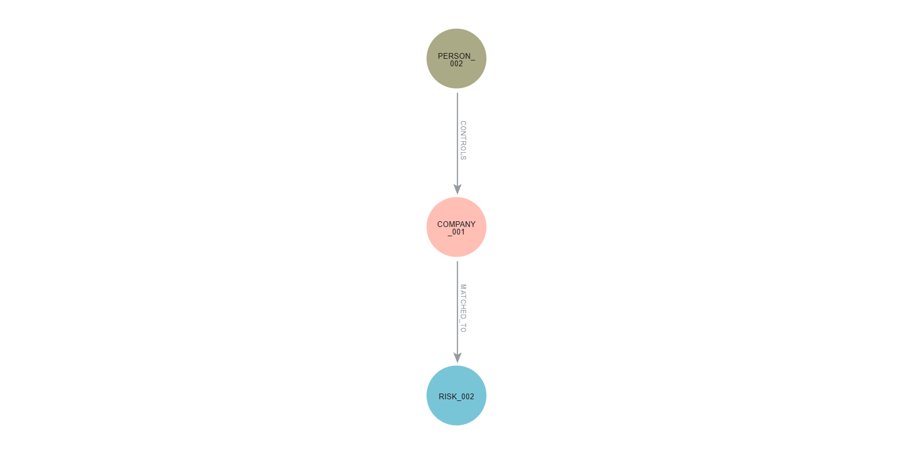

# Do KYC ao Know Your Networks

**Investigação de identidade, risco relacional e AML com Python, Neo4j, Graph Data Science e GraphRAG**

Este projeto investiga como diferentes métodos podem ser combinados para ampliar o contexto disponível em processos de **KYC, sanctions screening e AML**, sem transformar automaticamente sinais analíticos em decisões de compliance.

A análise parte de uma pergunta básica:

> **Quem é esta entidade?**

e evolui progressivamente para:

> **Com quem ela está conectada, como os recursos circulam pela rede e quais evidências justificam revisão adicional?**

O projeto combina **entity resolution**, testes de robustez, análise de grafos, Graph Data Science, detecção de padrões transacionais e GraphRAG em uma arquitetura modular e rastreável.

---

## Visão geral

Sistemas de KYC e AML precisam lidar simultaneamente com problemas diferentes:

- nomes semelhantes pertencentes a pessoas distintas;
- aliases e variações legítimas da mesma identidade;
- informações incompletas ou divergentes;
- exposição indireta por empresas, dispositivos ou endereços;
- padrões transacionais distribuídos ao longo do tempo;
- grande volume de candidatos sujeitos a capacidade limitada de revisão.

Em vez de tratar todos esses problemas com uma única técnica, o projeto adota uma arquitetura em camadas:

```text
fonte oficial
      ↓
ingestão e normalização
      ↓
entity resolution
      ↓
avaliação e stress testing
      ↓
screening e análise relacional
      ↓
Graph Data Science
      ↓
AML transacional
      ↓
GraphRAG
      ↓
síntese investigativa
      ↓
revisão humana
```

A premissa central é que **identidade, relacionamento, comportamento e risco são dimensões relacionadas, mas não equivalentes**.

---

## Principais resultados

| Camada | Resultado principal | Interpretação |
|---|---|---|
| Correspondência exata | Recall **0,000** no benchmark adversarial | excessivamente restritiva diante de aliases e variações nominais |
| Similaridade nominal | Recall **1,000**, Precisão **0,500**, AP **0,624** | útil para geração de candidatos, insuficiente para confirmação de identidade |
| Matching multivariado | F1 ≈ **0,996**, AP **1,000** no benchmark base | atributos contextuais acrescentam forte poder discriminativo |
| Robustez | degradação contextual reduz principalmente o Recall | qualidade dos dados faz parte do risco do modelo |
| Expansão em rede | Recall **0,333 → 1,000** | relações revelam exposições invisíveis ao screening individual |
| Priorização relacional | fila **37 → 17 candidatos**, preservando Recall **0,833** | expansão precisa ser acompanhada de gestão do ruído |
| Centralidade de grau | maior hub da rede era propositalmente legítimo | importância estrutural não equivale a risco |
| Louvain | **17 comunidades**, modularidade ≈ **0,705** | comunidades acrescentam contexto estrutural |
| AML transacional | dois padrões controlados recuperados | estrutura, direção, tempo e valor podem ser analisados conjuntamente |
| GraphRAG | evidências distribuídas reunidas em uma síntese rastreável | potencial para facilitar investigação e comunicação sem substituir julgamento humano |

Os resultados devem ser interpretados dentro de um **ambiente experimental controlado**. O projeto não pretende estimar diretamente performance produtiva de um sistema institucional de KYC/AML.

---

## 1. Entity Resolution

A primeira etapa avalia três abordagens para distinguir registros pertencentes à mesma identidade de registros nominalmente semelhantes pertencentes a pessoas diferentes:

1. correspondência exata;
2. similaridade nominal com `RapidFuzz`;
3. regressão logística multivariada combinando nome e atributos contextuais.

O benchmark foi construído a partir de indivíduos e aliases da **OFAC SDN Advanced**, utilizando:

- **10.944 pares positivos** associados ao mesmo `ofac_id`;
- **10.944 hard negatives** pertencentes a identidades distintas;
- **21.888 pares** no total.

Os hard negatives foram selecionados deliberadamente entre candidatos nominalmente semelhantes.

Uma característica importante do benchmark é que a similaridade nominal média dos negativos foi superior à dos pares verdadeiros:

```text
Hard negatives: 0,818
Pares positivos: 0,755
```

O experimento testa, portanto, uma situação em que **o nome sozinho pode ser enganoso**.


---

## 2. Robustez do matching

Um desempenho elevado em dados estruturados não garante estabilidade quando as evidências começam a se deteriorar.

O modelo multivariado foi submetido a stress tests mantendo:

- o modelo congelado;
- o threshold de decisão fixo em **0,805**;
- apenas a qualidade das entradas sendo modificada.

Foram introduzidos:

- missingness;
- divergências contextuais;
- ruído nominal;
- combinações progressivamente mais severas dessas condições.

O principal resultado foi que a degradação afeta sobretudo o **Recall**, enquanto a Precisão permanece elevada.

Isso indica que, nesse benchmark, o modelo tende a se tornar mais conservador à medida que perde evidências, aumentando principalmente o risco de **falsos negativos**.


Outro resultado relevante foi a diferença entre desempenho no threshold fixo e capacidade de ranking.

Mesmo em um cenário severamente degradado:

```text
F1 ≈ 0,644
AP ≈ 0,928
```

A decisão binária deteriorou antes da capacidade do score de ordenar candidatos.

---

## 3. Neo4j e análise relacional

Após resolver a identidade, o projeto adiciona uma nova pergunta:

> **Com quem esta entidade está conectada?**

Uma rede sintética controlada foi construída com:

| Elemento | Quantidade |
|---|---:|
| Pessoas | 100 |
| Empresas | 25 |
| Contas | 125 |
| Dispositivos | 30 |
| Endereços | 35 |
| Entidades sintéticas de risco | 5 |
| **Nós totais** | **320** |
| **Relacionamentos** | **366** |

O ground truth inclui exposições diretas e indiretas por:

- estruturas societárias;
- dispositivos compartilhados;
- endereços;
- referências de risco.

### Screening direto versus expansão da rede

| Estratégia | Candidatos | TP | FP | FN | Precisão | Recall | F1 |
|---|---:|---:|---:|---:|---:|---:|---:|
| Screening direto | 2 | 2 | 0 | 4 | 1,000 | 0,333 | 0,500 |
| Rede até 3 saltos | 37 | 6 | 31 | 0 | 0,162 | 1,000 | 0,279 |

A expansão recuperou todo o ground truth, mas aumentou significativamente o ruído investigativo.

Esse resultado evidencia um trade-off fundamental:

> **mais contexto aumenta capacidade de descoberta, mas também aumenta o custo de revisão.**

A análise dos tipos de caminho mostrou que sua semântica é tão importante quanto sua distância.

Caminhos como:

```text
MATCHED_TO
```

e

```text
CONTROLS > MATCHED_TO
```

foram muito mais discriminativos do que relações baseadas apenas em compartilhamento de dispositivos ou endereços.

### Priorização

Uma classificação exploratória dos caminhos permitiu reduzir a fila de:

```text
37 candidatos
      ↓
17 candidatos
```

preservando **5 dos 6 casos relevantes**.

O objetivo não é estabelecer uma regra universal de AML, mas demonstrar que a expansão relacional pode ser organizada segundo a qualidade informacional dos vínculos.



---

## 4. Graph Data Science

A projeção analítica do Neo4j Graph Data Science utilizou:

- `Person`;
- `Company`;
- `Device`;
- `Address`;
- `RiskEntity`.

Foram aplicados:

- **Degree Centrality**;
- **Louvain Community Detection**.

### Centralidade

O maior grau da rede pertenceu a:

```text
ADDRESS_035
degree = 10
```

Esse nó havia sido criado deliberadamente como um **hub legítimo**.

O resultado reforça um princípio importante:

> **centralidade estrutural não equivale a risco.**

### Comunidades

O Louvain identificou:

```text
17 comunidades
modularidade ≈ 0,705
```

As comunidades permitem contextualizar estruturas relacionais, mas não são interpretadas automaticamente como grupos de risco ou atividade ilícita.

---

## 5. AML transacional

A arquitetura foi posteriormente ampliada com **458 transações sintéticas**:

```text
450 transações de fundo
+
8 transações de ground truth
```

Dois padrões experimentais foram inseridos.

### Fluxo circular

```text
ACCOUNT_010
    ↓
ACCOUNT_011
    ↓
ACCOUNT_012
    ↓
ACCOUNT_010
```

A regra considera simultaneamente:

- três contas distintas;
- três transferências;
- ordem temporal;
- duração máxima de 6 horas;
- valor mínimo de USD 5.000 por transferência;
- preservação mínima de 80% do valor entre os movimentos.

### Concentração e repasse rápido

```text
4 remetentes
      ↓
ACCOUNT_005
      ↓
ACCOUNT_105
```

A regra exige:

- mínimo de 4 remetentes distintos;
- concentração das entradas em até 2 horas;
- mínimo de USD 9.000 recebidos;
- repasse em até 1 hora após a última entrada;
- transferência de pelo menos 80% do valor concentrado.

Os dois padrões controlados foram recuperados sem consulta ao ground truth durante a detecção.

Esse resultado representa **validação funcional em ambiente sintético**, e não estimativa de performance produtiva.

---

## 6. GraphRAG

A camada final integra Neo4j e modelo de linguagem por meio de **Graph Retrieval-Augmented Generation**.

```text
pergunta investigativa
        ↓
Text2Cypher
        ↓
consulta ao Neo4j
        ↓
evidências recuperadas
        ↓
LLM
        ↓
síntese investigativa
        ↓
revisão humana
```

A prova de conceito utiliza `PERSON_005`, uma entidade inteiramente sintética que reúne diferentes componentes do projeto:

- identidade;
- screening;
- dispositivos;
- conta;
- relacionamentos;
- transações.

O GraphRAG recupera as evidências diretamente do grafo e produz uma síntese organizada em:

- evidências observadas;
- contexto relacional;
- contexto transacional;
- motivos para revisão;
- limitações.

Três artefatos permanecem distinguíveis:

```text
Cypher gerado
      ↓
contexto retornado pelo Neo4j
      ↓
síntese produzida pelo LLM
```

Essa separação melhora a rastreabilidade da resposta, embora não elimine a necessidade de validar a consulta, a recuperação e a síntese.

> **O GraphRAG não produz uma nova classificação de risco: ele organiza evidências previamente estruturadas para facilitar revisão humana.**

---

## O que o projeto demonstra

A principal conclusão não é que uma única técnica seja superior às demais.

Cada camada responde a um problema diferente:

```text
nome
 ↓
candidate generation
 ↓
identidade
 ↓
screening
 ↓
relações
 ↓
estrutura
 ↓
comportamento
 ↓
priorização
 ↓
síntese
 ↓
revisão humana
```

Os experimentos mostram que:

1. **similaridade nominal não é identidade**;
2. **qualidade de dados é parte do risco do modelo**;
3. **mais contexto também pode gerar mais falsos positivos**;
4. **centralidade e comunidades descrevem estrutura, não irregularidade**;
5. **comportamento transacional acrescenta informação diferente da identidade**;
6. **rastreabilidade não elimina risco de modelo**;
7. **automação não substitui governança e revisão humana**.

---

## Governança e desenho experimental

Alguns princípios foram preservados ao longo de todo o pipeline:

### Ground truth isolado

Informações utilizadas para avaliação não são disponibilizadas aos mecanismos responsáveis pela detecção.

### Separação entre fonte, sinal e decisão

```text
fonte
  ↓
dado observado
  ↓
match / relacionamento
  ↓
sinal
  ↓
contexto
  ↓
priorização
  ↓
revisão humana
  ↓
decisão
```

### Dados reais e sintéticos

A OFAC é utilizada nas etapas de ingestão, screening e entity resolution.

Os experimentos públicos de rede e transações utilizam entidades inteiramente sintéticas.

### Proteção de dados

Arquivos derivados que não devem ser publicados são mantidos em áreas privadas do projeto e excluídos do repositório público.

---

## Limitações

Este projeto é um estudo experimental e possui limitações deliberadamente explícitas:

- apenas uma fonte externa oficial foi implementada;
- o benchmark de entity resolution é derivado da própria OFAC;
- a prevalência de positivos no benchmark foi artificialmente balanceada;
- não houve validação externa com registros independentes de onboarding;
- rede e transações são sintéticas;
- as regras AML não foram calibradas sobre comportamento bancário real;
- a priorização relacional foi construída de forma exploratória sobre o próprio ground truth;
- centralidade e comunidades dependem da projeção do grafo;
- o GraphRAG foi avaliado em uma única prova de conceito;
- não foi realizado benchmark institucional de factualidade, completude ou taxas de erro do LLM.

Os resultados demonstram **comportamento metodológico em ambiente controlado**, e não eficácia operacional universal.

---

## Estrutura do repositório

```text
know_your_networks_aml/
│
├── data/
│   ├── raw/
│   ├── processed/
│   │   ├── private/
│   │   └── public/
│   └── synthetic/
│
├── docs/
│   ├── 01_introducao.md
│   ├── 02_arquitetura.md
│   ├── 03_fontes_de_dados.md
│   ├── 04_ingestao_ofac.md
│   ├── 05_entity_resolution.md
│   ├── 06_robustez_matching.md
│   ├── 07_neo4j_aml.md
│   ├── 08_aml_transacional.md
│   └── 09_graphrag.md
│
├── reports/
│   └── figures/
│
├── src/
├── tests/
│
├── .env.example
├── .gitignore
├── requirements.txt
└── requirements-dev.txt
```

---

## Documentação técnica

A metodologia completa está dividida em nove capítulos:

1. [Introdução](docs/01_introducao.md)
2. [Arquitetura do projeto](docs/02_arquitetura.md)
3. [Fontes de dados e definição do escopo](docs/03_fontes_de_dados.md)
4. [Ingestão e estruturação da OFAC](docs/04_ingestao_ofac.md)
5. [Entity Resolution](docs/05_entity_resolution.md)
6. [Robustez do Matching](docs/06_robustez_matching.md)
7. [Neo4j e análise relacional em AML](docs/07_neo4j_aml.md)
8. [AML Transacional](docs/08_aml_transacional.md)
9. [GraphRAG](docs/09_graphrag.md)

---

## Stack

### Dados e análise

- Python
- pandas
- NumPy
- scikit-learn
- RapidFuzz

### Grafos

- Neo4j
- Cypher
- Neo4j Graph Data Science

### IA generativa

- Neo4j GraphRAG
- Text2Cypher
- LLM para síntese investigativa

### Qualidade e desenvolvimento

- pytest
- Ruff
- python-dotenv
- Git

---

## Reprodutibilidade

Crie o ambiente virtual e instale as dependências:

```bash
python -m venv .venv
```

### Windows

```bash
.venv\Scripts\activate
```

Instale as dependências:

```bash
pip install -r requirements.txt
pip install -r requirements-dev.txt
```

Crie o arquivo local de configuração a partir de:

```text
.env.example
```

As credenciais reais devem permanecer exclusivamente em `.env`, que não deve ser versionado.

Para verificar a qualidade do código:

```bash
ruff check src tests
```

Para executar os testes:

```bash
pytest
```

A execução das etapas que dependem do Neo4j requer uma instância local configurada e as variáveis correspondentes definidas no `.env`.

---

## Dados

O projeto utiliza como fonte externa oficial a **OFAC SDN Advanced**.

O dataset original e arquivos derivados completos não são redistribuídos neste repositório.

Os experimentos de rede e AML utilizam datasets sintéticos construídos especificamente para permitir análise pública, reprodutibilidade e ground truth controlado sem exposição de dados financeiros ou cadastrais reais.

---

## Considerações finais

Sistemas de KYC e AML não enfrentam apenas um problema de classificação. Eles precisam combinar identidade, qualidade de dados, contexto relacional, comportamento e capacidade limitada de revisão.

Este projeto mostra, de forma controlada e mensurável, como diferentes métodos podem ser organizados para transformar dados fragmentados em **contexto investigativo rastreável**, preservando uma distinção fundamental:

> **sinais ajudam a investigar; evidências ajudam a contextualizar; a decisão permanece humana.**

---

**Autor:** Manoel Barroso
