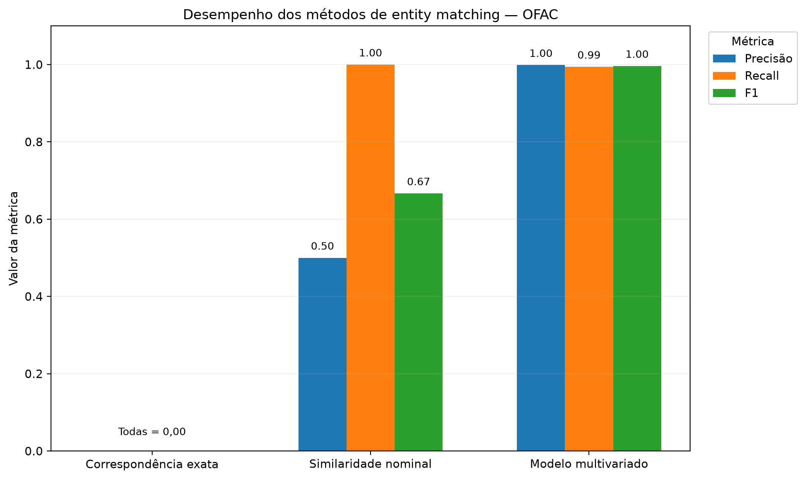
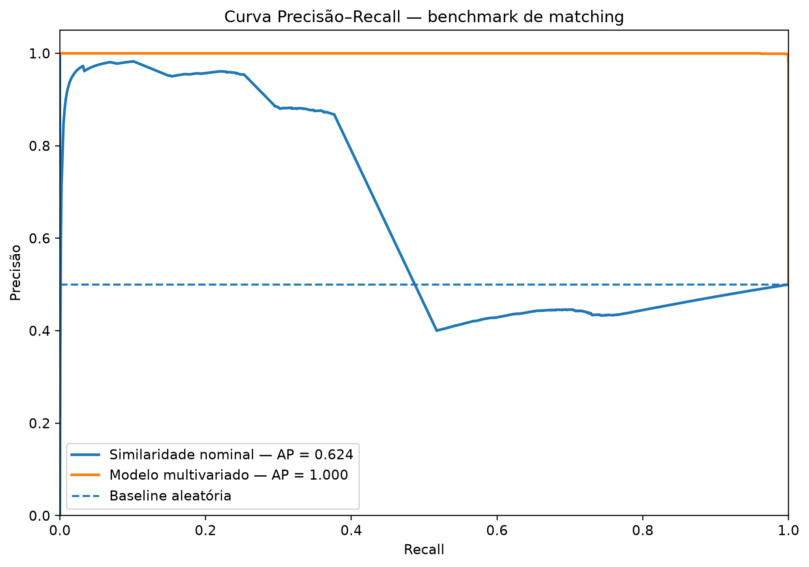

# 5. Entity Resolution: da similaridade nominal ao matching multivariado

## 5.1 Objetivo

Esta etapa avalia a capacidade de diferentes abordagens de **entity resolution** para distinguir registros referentes à mesma pessoa de registros nominalmente semelhantes pertencentes a pessoas diferentes.

O problema é particularmente relevante em processos de KYC e screening. Uma mesma identidade pode possuir aliases, transliterações e diferentes formas documentadas, enquanto pessoas distintas podem apresentar nomes altamente semelhantes.

São comparadas três abordagens:

1. **Correspondência exata (*Exact Match*)**;
2. **similaridade nominal com RapidFuzz**;
3. **matching multivariado**, combinando similaridade nominal e atributos contextuais de identidade.

O experimento busca avaliar não apenas se os métodos encontram correspondências, mas principalmente sua capacidade de **desambiguar candidatos difíceis**.

---

## 5.2 Construção do benchmark

A partir dos **7.479 indivíduos** estruturados na etapa anterior, foram identificados **10.944 pares positivos**, formados por diferentes representações nominais oficialmente associadas ao mesmo `ofac_id`.

Para cada par positivo foi construído um **hard negative**: uma pessoa diferente da OFAC selecionada por apresentar elevada similaridade nominal.

O benchmark final contém:

| Classe | Pares |
|---|---:|
| Pares positivos — mesmo `ofac_id` | **10.944** |
| Hard negatives — `ofac_id` distinto | **10.944** |
| **Total** | **21.888** |

A utilização de negativos nominalmente difíceis evita um benchmark artificialmente simples, no qual registros claramente distintos poderiam superestimar a capacidade dos algoritmos.

Para a construção balanceada foi deliberada: para cada par positivo foi selecionado um hard negative nominalmente difícil. Essa configuração favorece a comparação controlada entre métodos, mas não reproduz a prevalência de matches observada em um ambiente operacional de screening.

---

## 5.3 Evidências utilizadas

Além da similaridade nominal, o modelo utiliza atributos estruturados extraídos da OFAC.

Para os indivíduos do benchmark, a disponibilidade observada foi:

| Atributo | Cobertura |
|---|---:|
| Data de nascimento | 98,65% |
| Nacionalidade | 74,49% |
| Local de nascimento | 63,62% |
| Cidadania | 13,97% |
| Documento de identificação | 56,93% |

A disponibilidade de cada atributo é registrada separadamente de sua correspondência.

Assim:

> **informação ausente não é equivalente a informação incompatível.**

Essa distinção é importante tanto para o matching multivariado quanto para os testes de robustez posteriores.

---

## 5.4 Natureza adversarial do benchmark

A estratégia de seleção dos hard negatives produziu uma característica deliberadamente adversarial: os registros negativos apresentaram, em média, maior similaridade nominal do que os pares verdadeiros.

A similaridade nominal média foi:

| Classe | Similaridade média do nome |
|---|---:|
| Hard negatives | 0,818 |
| Matches reais | 0,755 |

Isso ocorre porque os negativos foram escolhidos justamente entre os candidatos nominalmente mais semelhantes.

O experimento, portanto, não pergunta apenas:

> “Os nomes são parecidos?”

Ele testa uma questão mais relevante para screening:

> **“Quando dois nomes são muito parecidos, atributos adicionais conseguem distinguir corretamente as identidades?”**

---

## 5.5 Métodos avaliados

### 5.5.1 Correspondência exata

A abordagem mais restritiva exige correspondência integral entre os nomes normalizados.

Ela é pouco tolerante a aliases, alterações ortográficas, transliterações e outras representações legítimas da mesma identidade.

### 5.5.2 Similaridade nominal

O segundo método utiliza o `WRatio` do **RapidFuzz** para estimar a similaridade entre os nomes.

Esse tipo de medida é especialmente útil para **geração de candidatos**, mas não incorpora informações contextuais como nascimento, nacionalidade ou documentação.

### 5.5.3 Modelo multivariado

O terceiro método utiliza **regressão logística** para combinar diferentes evidências de identidade:

- similaridade nominal;
- disponibilidade e correspondência da data de nascimento;
- local de nascimento;
- nacionalidade;
- cidadania;
- documentação oficial.

O terceiro método utiliza **regressão logística** para combinar diferentes evidências de identidade:

- similaridade nominal;
- disponibilidade e correspondência da data de nascimento;
- disponibilidade e correspondência do local de nascimento;
- disponibilidade e correspondência da nacionalidade;
- disponibilidade e correspondência da cidadania;
- disponibilidade e correspondência documental.

Essa representação preserva a distinção entre **atributo ausente** e **atributo observado, porém incompatível**.

O objetivo não é substituir o nome, mas utilizá-lo como uma evidência entre várias.

---

## 5.6 Protocolo experimental

O benchmark foi separado por `ofac_id`, evitando que representações da mesma pessoa aparecessem simultaneamente nos conjuntos de treinamento e teste.

A divisão resultou em:

| Amostra | Pares |
|---|---:|
| Treino | **13.022** |
| Validação | **4.392** |
| Teste | **4.474** |

Os thresholds foram escolhidos exclusivamente no conjunto de validação e posteriormente mantidos fixos no conjunto de teste.

Os thresholds foram selecionados para maximizar o desempenho dentro deste benchmark experimental. Eles não devem ser interpretados como thresholds operacionais universais de KYC ou screening, pois o ponto de decisão em produção também depende da prevalência dos casos, do custo relativo de falsos positivos e falsos negativos e da capacidade disponível de revisão humana.

Os thresholds selecionados foram:

| Método | Threshold |
|---|---:|
| Correspondência exata | **1,000** |
| RapidFuzz | **0,000** |
| Modelo multivariado | **0,805** |

Essa separação impede a seleção do threshold com base no desempenho observado posteriormente no conjunto de teste.

## 5.7 Resultados no conjunto de teste

| Método | Precisão | Recall | F1 | Precisão média (AP) |
|---|---:|---:|---:|---:|
| Correspondência exata | 0,000 | 0,000 | 0,000 | 0,500 |
| Similaridade nominal | 0,500 | 1,000 | 0,667 | 0,624 |
| Modelo multivariado | 0,999 | 0,994 | 0,996 | 1,000 |

A AP de `0,500` da correspondência exata não representa capacidade discriminativa relevante. Como o benchmark é balanceado e o método praticamente não produz separação útil entre os pares, esse valor corresponde essencialmente ao nível-base do conjunto.

## 5.8 Interpretação dos resultados

A correspondência exata mostrou-se excessivamente restritiva para um universo com aliases e diferentes representações nominais.

A similaridade nominal apresentou **Recall de 1,00**, mas Precisão de apenas **0,50**. No benchmark construído, o threshold que maximiza F1 equivale praticamente a aceitar todos os candidatos, evidenciando que o nome isoladamente não é suficiente para separar os hard negatives.

O modelo multivariado apresentou desempenho substancialmente superior porque incorporou evidências independentes da similaridade do nome.

Isso não significa que o RapidFuzz seja inadequado.

Seu papel é particularmente útil para **candidate generation** e busca aproximada. O resultado mostra, entretanto, que similaridade nominal não deve ser interpretada isoladamente como confirmação de identidade.

O threshold `0,000` selecionado para o RapidFuzz evidencia a dificuldade do problema nominal neste benchmark: para maximizar F1, o método precisa praticamente aceitar todos os candidatos. Isso reforça que, diante de hard negatives altamente semelhantes, o nome sozinho possui capacidade limitada de decisão.

---

## 5.9 Curva Precisão–Recall

A curva Precisão–Recall reforça a diferença entre as duas abordagens contínuas.

A similaridade nominal apresentou **AP de aproximadamente 0,624**, enquanto o modelo multivariado atingiu **AP de 1,000** no benchmark base.

A Precisão Média (*Average Precision*) avalia a capacidade de ordenar candidatos verdadeiros acima dos falsos ao longo dos diferentes thresholds.

No benchmark base, o modelo multivariado apresentou capacidade de ordenação praticamente perfeita. Esse resultado deve ser interpretado dentro das condições controladas do experimento e não como estimativa direta de desempenho em produção.

A própria Precisão Média deve ser interpretada à luz da composição do benchmark. Como a amostra foi construída com proporção aproximada de 50% de positivos e 50% de negativos, seus valores não são diretamente comparáveis aos de um processo operacional no qual correspondências verdadeiras podem representar uma fração muito menor dos candidatos avaliados.

---

## 5.10 Limitações do benchmark base

Um desempenho próximo da perfeição não deve ser interpretado automaticamente como evidência de desempenho equivalente em produção.

Os atributos dos pares positivos são provenientes da mesma fonte oficial e apresentam elevada consistência. Dados reais de onboarding e monitoramento podem conter:

- campos ausentes;
- erros de digitação;
- datas incompletas;
- documentos indisponíveis;
- nacionalidades divergentes;
- informações desatualizadas;
- aliases não observados anteriormente.

Por esse motivo, o resultado base é tratado como um **benchmark controlado**, e não como conclusão definitiva sobre a eficácia operacional do modelo.

Além disso, os pares positivos são derivados de representações pertencentes à própria fonte OFAC. Portanto, o experimento mede com precisão o comportamento do modelo nesse benchmark, mas não constitui validação externa com registros independentes de onboarding.

Outra limitação importante é a **prevalência artificialmente balanceada** do benchmark. Metade dos pares é positiva e metade corresponde a hard negatives, configuração útil para comparar os métodos sob condições controladas, mas diferente de grande parte dos ambientes reais de screening.

Em uma população operacional com baixa prevalência de matches verdadeiros, mesmo um modelo com elevada sensibilidade e especificidade pode gerar quantidade relevante de falsos positivos. Por esse motivo, métricas como Precisão, F1 e Average Precision observadas neste experimento não devem ser transportadas diretamente para produção.

Além disso, o score produzido pela regressão logística não deve ser interpretado automaticamente como uma probabilidade operacional calibrada de identidade. A amostragem balanceada e a seleção deliberada de hard negatives alteram a distribuição observada durante o treinamento.

Uma implementação produtiva exigiria, entre outros elementos:

- validação externa com dados independentes;
- avaliação sobre a prevalência real de candidatos;
- calibração do score, quando necessária;
- definição de thresholds segundo custos de erro e capacidade de revisão;
- monitoramento de drift e estabilidade das variáveis;
- acompanhamento separado de falsos positivos e falsos negativos.

A etapa seguinte submete o mesmo modelo, com seu threshold mantido fixo, a cenários progressivamente degradados.

---

## 5.11 Síntese

Os resultados mostram que a principal limitação do matching exclusivamente nominal aparece justamente nos casos mais relevantes para investigação: **nomes altamente semelhantes associados a identidades diferentes**.

A incorporação de atributos contextuais transforma a comparação de strings em um problema de resolução de identidade baseado em múltiplas evidências.

No benchmark controlado, essa mudança produziu um ganho substancial de desempenho. Entretanto, a vantagem depende da disponibilidade e consistência das informações auxiliares.

A questão seguinte deixa de ser:

> **“O modelo funciona em dados limpos?”**

e passa a ser:

> **“Quanto dessa vantagem permanece quando a qualidade das evidências se deteriora?”**

Essa questão é analisada no capítulo seguinte por meio de cenários progressivos de degradação dos dados.
