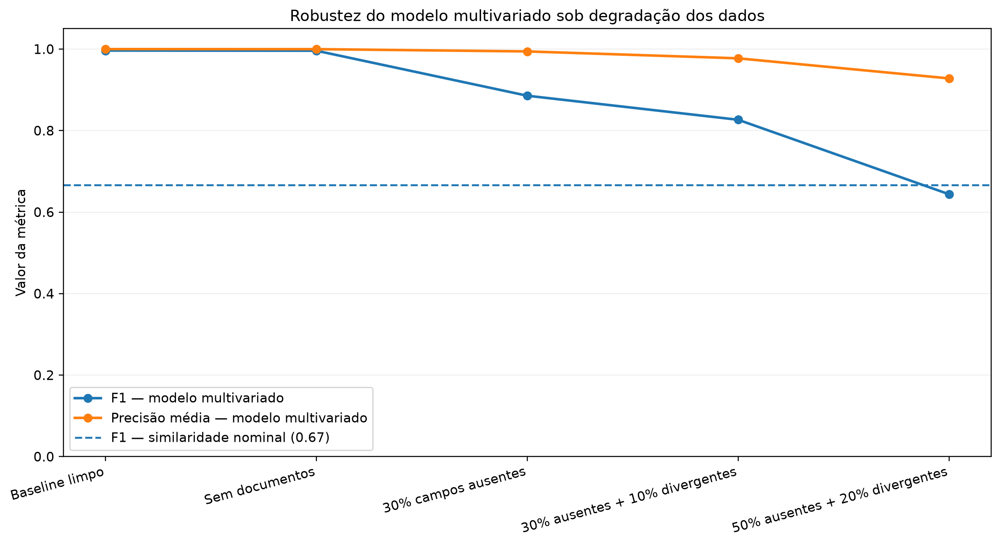
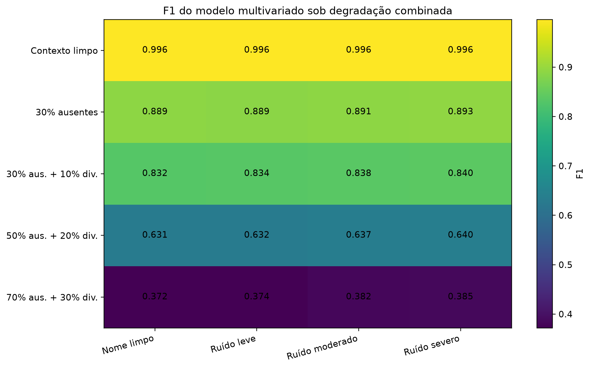
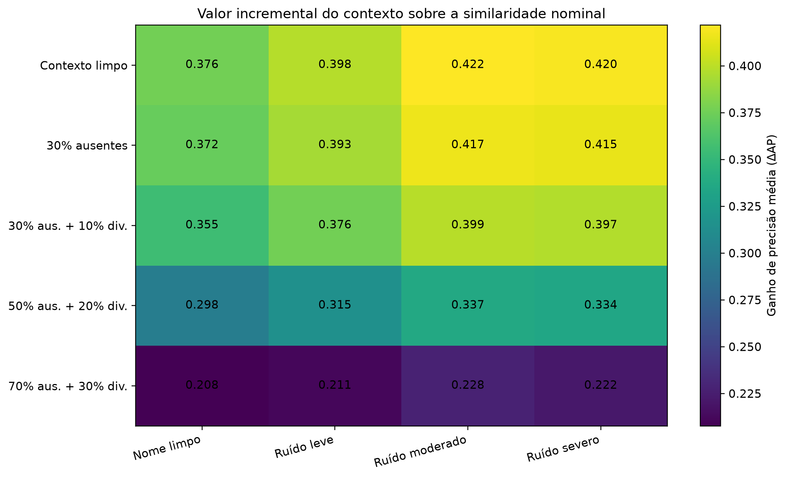

# 6. Robustez do Matching sob degradação dos dados

## 6.1 Motivação

No benchmark base, o modelo multivariado apresentou desempenho elevado:

| Métrica | Resultado |
|---|---:|
| Precisão | **0,9987** |
| Recall | **0,9942** |
| F1 | **0,9964** |
| Precisão média (AP) | **1,0000** |

Esses resultados foram obtidos sobre atributos derivados da própria fonte oficial da OFAC, caracterizada por elevada consistência interna.

Em ambientes reais de KYC, onboarding e monitoramento, entretanto, informações podem estar ausentes, incompletas, desatualizadas ou divergentes entre diferentes sistemas e fontes.

Por isso, o desempenho no benchmark limpo não é suficiente para avaliar a **robustez do método diante da degradação das evidências de entrada**.

A etapa de stress testing busca responder:

> **Quanto da vantagem do matching multivariado permanece quando as evidências disponíveis começam a se deteriorar?**

---

## 6.2 Desenho experimental

O modelo multivariado e seu **threshold de decisão no benchmark** foram definidos utilizando os conjuntos de treino e validação do experimento original.

O threshold selecionado foi:

```text
0,805
```

Durante todos os testes de robustez:

- o modelo não foi retreinado;
- o threshold não foi recalibrado;
- apenas a qualidade das evidências de entrada foi modificada.

Essa escolha evita recalibrar o modelo especificamente para cada cenário degradado e permite observar como uma configuração previamente definida se comporta à medida que a qualidade das entradas se deteriora.

**Foram testadas três dimensões principais de degradação:**

1. **missingness** — remoção de atributos anteriormente disponíveis;
2. **divergência contextual** — transformação de evidências compatíveis em informações conflitantes;
3. **ruído nominal** — perturbações introduzidas diretamente nos nomes.

Os cenários constituem stress tests sintéticos controlados. Eles avaliam sensibilidade e não devem ser interpretados como estimativas de frequência ou severidade de erros observados em produção.

---

## 6.3 Degradação dos atributos contextuais

Os primeiros cenários preservaram o nome e degradaram progressivamente atributos como:

- data de nascimento;
- nacionalidade;
- local de nascimento;
- cidadania;
- documentos.

Os resultados foram:

| Cenário | Precisão | Recall | F1 | Precisão média (AP) |
|---|---:|---:|---:|---:|
| Baseline limpo | 0,9987 | 0,9942 | 0,9964 | 1,0000 |
| Sem documentos | 0,9987 | 0,9933 | 0,9960 | 0,9999 |
| 30% dos campos ausentes | 0,9983 | 0,7957 | 0,8856 | 0,9943 |
| 30% ausentes + 10% divergentes | 0,9981 | 0,7054 | 0,8266 | 0,9774 |
| 50% ausentes + 20% divergentes | 0,9981 | 0,4752 | 0,6439 | 0,9281 |



### 6.3.1 Interpretação

A degradação dos dados afeta principalmente o **Recall**, enquanto a Precisão permanece próxima de 1,00.

Neste benchmark, a perda de evidências não produziu aumento relevante de falsos positivos no threshold mantido fixo.

O efeito predominante foi outro:

> **o sistema torna-se mais conservador e começa a deixar de reconhecer matches verdadeiros.**

Em termos do experimento, a deterioração da qualidade dos dados aumenta principalmente a incidência de **falsos negativos**.

Outro resultado relevante é a retirada completa dos documentos.

Apesar de documentos constituírem evidências fortes de identidade, sua ausência isolada praticamente não alterou o desempenho:

- F1 baseline: **0,9964**
- F1 sem documentos: **0,9960**

Neste benchmark, nascimento, nacionalidade, local de nascimento e evidência nominal foram suficientes para manter praticamente todo o desempenho quando apenas a documentação foi removida.

Isso não significa que documentos sejam irrelevantes. O resultado indica apenas que sua contribuição é parcialmente redundante quando outras evidências altamente discriminativas estão disponíveis.

---

## 6.4 Desempenho de decisão versus capacidade de priorização

No cenário de **50% dos atributos ausentes + 20% divergentes**, o F1 caiu para **0,6439**, enquanto a Precisão Média permaneceu em **0,9281**.

As duas métricas avaliam propriedades diferentes:

- **F1** mede o desempenho da classificação produzida por um threshold específico;
- **AP** mede a capacidade do score de ordenar candidatos verdadeiros acima dos falsos ao longo de diferentes thresholds.

A divergência entre essas métricas indica que a degradação prejudica fortemente a decisão no threshold originalmente selecionado, mas preserva parte substancial da capacidade de **ranqueamento**.

> **Um modelo pode deixar de funcionar adequadamente como classificador binário em determinado threshold e ainda conservar valor como mecanismo de priorização para revisão humana.**

Essa distinção é particularmente relevante em screening, no qual frequentemente existe uma fila de candidatos sujeita a capacidade limitada de análise.
De modo que tal capacidade de ranqueamento também deve ser interpretada dentro da composição controlada do benchmark. A AP elevada indica preservação da ordenação relativa entre positivos e hard negatives nos cenários testados, mas não estima diretamente o desempenho de uma fila operacional com prevalência distinta de matches verdadeiros.

---

## 6.5 Ruído nominal isolado

Também foram introduzidas perturbações diretamente nos nomes, incluindo troca e remoção de caracteres, retirada de tokens e combinações dessas alterações.

Quando apenas o nome foi degradado, o impacto sobre o modelo multivariado foi limitado. Os demais atributos permaneceram íntegros e compensaram parte da perda de informação nominal.

Esse resultado motivou um teste mais exigente:

> **degradar simultaneamente o nome e o contexto.**

---

## 6.6 Degradação combinada de nome e contexto

O experimento seguinte cruza duas dimensões de qualidade dos dados.

**Qualidade nominal:**

- nome limpo;
- ruído leve;
- ruído moderado;
- ruído severo.

**Qualidade contextual:**

- contexto limpo;
- 30% dos atributos ausentes;
- 30% ausentes + 10% divergentes;
- 50% ausentes + 20% divergentes;
- 70% ausentes + 30% divergentes.



### 6.6.1 Interpretação

O heatmap revela que a principal deterioração ocorre na dimensão **contextual**.

Com contexto íntegro, o F1 permanece próximo de **0,996**, mesmo quando são introduzidas perturbações nominais.

À medida que atributos contextuais desaparecem ou divergem, o desempenho cai progressivamente:

| Qualidade contextual | F1 aproximado |
|---|---:|
| Contexto limpo | **0,996** |
| 30% ausentes | **0,89** |
| 30% ausentes + 10% divergentes | **0,83–0,84** |
| 50% ausentes + 20% divergentes | **0,63–0,64** |
| 70% ausentes + 30% divergentes | **0,37–0,39** |

Neste benchmark:

> **a qualidade das evidências contextuais é mais determinante para a robustez do entity resolution do que pequenas ou moderadas degradações nominais.**

Pequenas variações horizontais não devem ser interpretadas como benefício produzido pelo ruído. Em alguns casos, a perturbação também reduz a similaridade dos hard negatives, tornando-os marginalmente mais fáceis de distinguir.

---

## 6.7 Valor incremental das evidências contextuais

A análise seguinte mede diretamente quanto o modelo multivariado acrescenta sobre a similaridade nominal isolada.

A métrica utilizada é:

**ΔAP = AP multivariado − AP nominal**



Os ganhos observados variaram aproximadamente entre:

**+0,21 e +0,42 de AP**

dependendo do cenário.

Com contexto limpo, o ganho sobre o nome isolado chegou a aproximadamente:

**+0,42 de AP**

Mesmo no cenário mais severo, o contexto continuou adicionando aproximadamente:

**+0,21 a +0,23 de AP**

### 6.7.1 Interpretação

O resultado mostra que o contexto acrescenta poder discriminativo em todos os cenários avaliados.

O benefício diminui quando as próprias evidências contextuais se deterioram, mas permanece positivo mesmo nos cenários mais severos.

Dois comportamentos são observados:

1. quanto pior a qualidade do contexto, menor o benefício adicional do modelo multivariado;
2. quanto mais ambígua a informação nominal, maior a importância relativa das evidências auxiliares.

**O contexto funciona, portanto, como mecanismo de compensação para parte da ambiguidade nominal.**

---

## 6.8 Papéis dos métodos

Os resultados não indicam que um único método deva substituir os demais.

| Método | Papel principal | Limitação |
|---|---|---|
| Correspondência exata | Regra altamente restritiva | Baixa tolerância a variações legítimas |
| Similaridade nominal | Geração e busca de candidatos | Ambiguidade entre nomes semelhantes |
| Matching multivariado | Desambiguação de identidade | Dependência da qualidade do contexto |

Essa complementaridade sugere uma arquitetura em camadas, em vez da escolha de um único algoritmo universal.

---

## 6.9 Implicações para KYC e screening

Os resultados sugerem uma arquitetura em que geração de candidatos, resolução de identidade e priorização investigativa permanecem separadas:

```text
busca nominal
      ↓
geração de candidatos
      ↓
contexto de identidade
      ↓
matching multivariado
      ↓
score de correspondência
      ↓
revisão / resolução da identidade
      ↓
contexto de risco e relacionamento
      ↓
priorização investigativa
```
Essa arquitetura permite distinguir duas perguntas:

**“Qual a evidência de que dois registros representam a mesma identidade?”**

e:

**“Qual a prioridade investigativa dessa identidade?”**

O matching responde à primeira questão.

A segunda exige informações adicionais sobre risco, relacionamentos e comportamento. Portanto, um score elevado de identidade não equivale a um score de risco.

---

## 6.10 Limitações dos testes de robustez

Os cenários de degradação foram construídos artificialmente para testar a sensibilidade do modelo sob condições controladas.

Portanto:

- as proporções de missingness e divergência não representam estimativas de incidência observadas em instituições reais;
- os testes não reproduzem toda a dependência existente entre erros de diferentes campos;
- o benchmark permanece derivado de registros pertencentes à mesma fonte oficial;
- o experimento não constitui validação externa com dados independentes de onboarding;
- a manutenção do threshold original permite medir estabilidade operacional, mas não avalia estratégias posteriores de recalibração.
- as métricas permanecem condicionadas ao benchmark artificialmente balanceado entre pares positivos.

Os resultados devem ser interpretados como **análise de sensibilidade**, e não como previsão de desempenho produtivo.

## 6.11 Síntese

Os experimentos mostram que o ganho do modelo multivariado depende não apenas do algoritmo, mas também da **qualidade e disponibilidade das evidências utilizadas**.

Três conclusões se destacam:

1. a similaridade nominal é útil para geração de candidatos, mas insuficiente para confirmação de identidade em casos adversariais;
2. atributos contextuais acrescentam poder discriminativo relevante e compensam parte da degradação nominal;
3. quando o próprio contexto se deteriora severamente, Recall e F1 caem rapidamente, embora parte da capacidade de ranqueamento seja preservada.

A conclusão não é que uma abordagem seja universalmente superior.

> **Cada método cumpre uma função específica, e sua eficácia depende tanto da qualidade das evidências quanto do tipo de decisão que o sistema precisa apoiar.**

Até esta etapa, a análise respondeu principalmente:

> **“Quem é esta entidade?”**

A partir do próximo capítulo, a pergunta passa a incluir:

> **“Com quem esta entidade está conectada?”**

Essa transição introduz o Neo4j e a análise de redes como uma nova camada de contexto investigativo.
