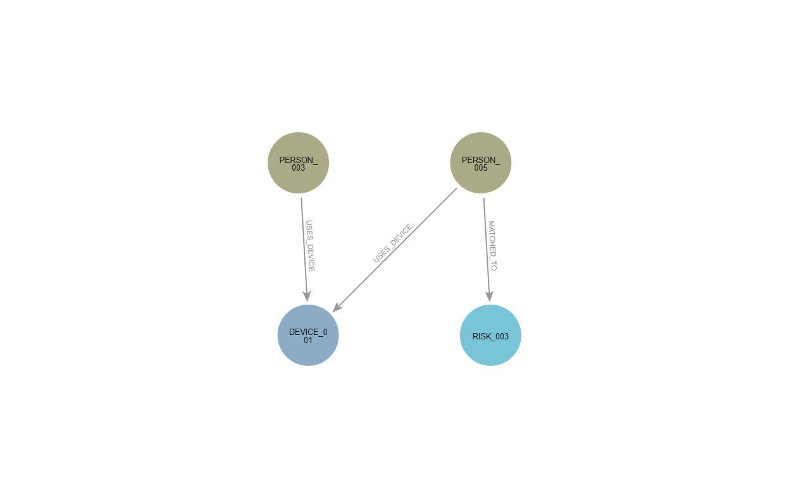
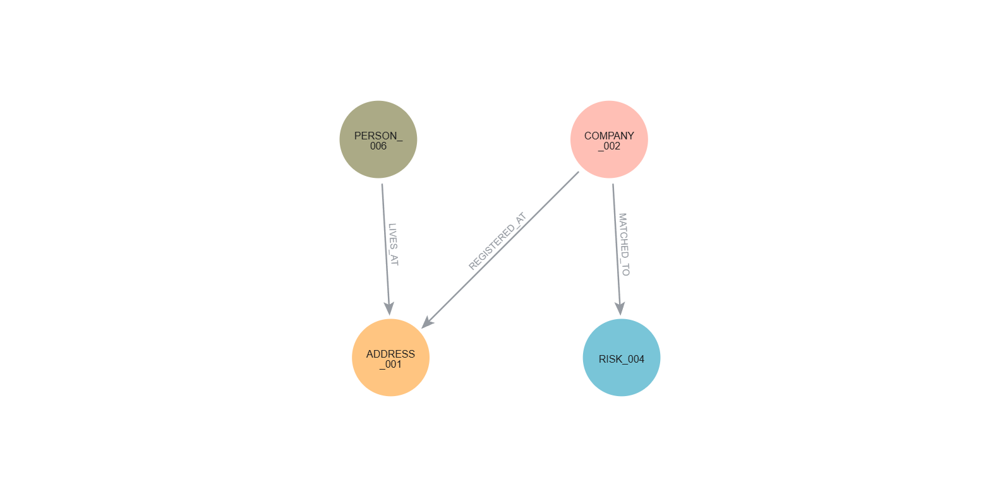

# 7. Neo4j e análise relacional em AML

## 7.1 Da identidade individual à investigação de redes

As etapas anteriores concentraram-se em **entity resolution**: identificar se diferentes registros podem representar a mesma pessoa.

Esse problema é fundamental para KYC e screening, mas representa apenas uma parte da investigação.

Uma entidade pode não apresentar um alerta direto e ainda assim estar conectada a:

- empresas relacionadas;
- outras pessoas;
- contas;
- dispositivos compartilhados;
- endereços recorrentes;
- estruturas societárias;
- referências de risco;
- fluxos financeiros.

A pergunta deixa, portanto, de ser apenas:

> **“Quem é esta entidade?”**

e passa a incluir:

> **“Com quem esta entidade está conectada e qual é a natureza dessas conexões?”**

É essa mudança que aproxima o projeto da ideia de **Know Your Networks**.

## 7.2 Objetivo da análise relacional

Bancos de dados relacionais representam eficientemente registros tabulares. Em investigações AML, entretanto, parte relevante da informação pode estar na **estrutura formada pelas relações entre diferentes entidades**.

Um caso sem alerta individual pode adquirir contexto quando são consideradas conexões com outras pessoas, empresas, dispositivos, endereços ou referências de risco.

O Neo4j foi utilizado para avaliar se a incorporação dessa estrutura relacional acrescenta informação investigativa ao screening individual.

As principais questões analisadas foram:

1. exposições indiretas podem ser recuperadas a partir da rede?
2. quanto de Recall é acrescentado pela expansão relacional?
3. quanto ruído adicional essa expansão produz?
4. diferentes tipos de caminho possuem o mesmo valor investigativo?
5. que contexto estrutural adicional pode ser obtido por meio de centralidade e detecção de comunidades?

O objetivo não é utilizar o grafo como classificador automático de irregularidade, mas como uma camada adicional de **descoberta, contextualização e priorização**.

## 7.3 Rede sintética e ground truth

Os experimentos em grafo utilizam uma **rede experimental inteiramente sintética**.

Foram gerados artificialmente:

- 100 pessoas;
- 25 empresas;
- 125 contas;
- 30 dispositivos;
- 35 endereços;
- 5 entidades de risco.

A rede inicial contém:

| Estrutura | Quantidade |
|---|---:|
| Nós | **320** |
| Relacionamentos | **366** |

As `RiskEntity` são referências sintéticas utilizadas para representar entidades previamente sinalizadas. Embora possam carregar uma propriedade de origem como `OFAC`, elas **não representam pessoas ou organizações reais da lista oficial**.

Padrões relacionais foram inseridos previamente como ground truth, incluindo:

- exposição direta;
- exposição indireta via empresa;
- compartilhamento de dispositivo;
- compartilhamento de endereço;
- um hub legítimo de alta conectividade.

Essa construção permite medir se as consultas recuperam estruturas previamente conhecidas sem apresentar indivíduos reais como objetos de uma investigação AML fictícia.

O ground truth é utilizado apenas na **avaliação posterior dos resultados**, permanecendo separado das consultas responsáveis pela detecção.

## 7.4 Modelo de grafo implementado

### 7.4.1 Nós

A rede foi construída com seis tipos de nós:

| Nó | Função |
|---|---|
| `Person` | pessoa sintética |
| `Company` | empresa sintética |
| `Account` | conta financeira |
| `Device` | dispositivo associado a usuários |
| `Address` | endereço associado a pessoas ou empresas |
| `RiskEntity` | referência sintética de risco |

As transações são incorporadas posteriormente como **relacionamentos entre contas**, evitando a criação desnecessária de um nó para cada operação.

### 7.4.2 Relacionamentos

Os principais relacionamentos estruturais são:

| Relacionamento | Significado |
|---|---|
| `OWNS` | pessoa ou empresa possui uma conta |
| `USES_DEVICE` | pessoa utiliza determinado dispositivo |
| `LIVES_AT` | pessoa está associada a um endereço |
| `CONTROLS` | pessoa controla uma empresa |
| `REGISTERED_AT` | empresa está registrada em determinado endereço |
| `MATCHED_TO` | pessoa ou empresa possui vínculo com uma referência sintética de risco |

A etapa transacional acrescenta posteriormente:

| Relacionamento | Significado |
|---|---|
| `TRANSFERRED_TO` | transferência financeira entre duas contas |

Os relacionamentos possuem semântica explícita. A existência de uma conexão representa uma **evidência estrutural observada no experimento**, e não uma conclusão automática de risco.

## 7.5 Entity resolution como entrada do grafo

A análise em grafo não substitui o matching desenvolvido nos capítulos anteriores.

As duas etapas respondem a perguntas diferentes:

```text
ENTITY RESOLUTION
        ↓
"Quem é esta entidade?"
        ↓
IDENTIDADE RESOLVIDA
        ↓
      NEO4J
        ↓
"Com quem ela está conectada?"
```
Na rede sintética, o relacionamento `MATCHED_TO` representa de forma controlada um resultado de screening previamente estabelecido para o experimento. Ele não corresponde à inclusão de indivíduos reais da OFAC no cenário sintético.

Assim, confiança de identidade e contexto de rede permanecem conceitualmente separados:

> **um match de identidade não constitui, por si só, uma classificação de risco.**

## 7.6 Exposição direta e indireta

A análise distingue explicitamente dois níveis de exposição.

**Exposição direta:**

```text
Person
   │
MATCHED_TO
   │
RiskEntity
```
**Exposição indireta:**

```text
Person_A ──USES_DEVICE──> Device <──USES_DEVICE── Person_B
                                                   │
                                                   └──MATCHED_TO──> RiskEntity
```

Nesse exemplo, a exposição não resulta de um vínculo direto entre `Person_A` e a `RiskEntity`, mas de um caminho relacional intermediado por um dispositivo compartilhado.

Um caminho no grafo representa **contexto relacional**, e não confirmação automática de risco.

## 7.7 Desenho da avaliação

A contribuição do grafo foi avaliada comparando diferentes níveis de expansão investigativa:

1. **screening direto** — apenas vínculos diretos com `RiskEntity`;
2. **rede expandida** — caminhos de até três saltos;
3. **priorização por tipo de caminho** — ordenação dos candidatos segundo a natureza das relações.

O ground truth contém **seis pares pessoa–risco relevantes**.

Para cada estratégia foram calculados:

- verdadeiros positivos (TP);
- falsos positivos (FP);
- falsos negativos (FN);
- Precisão;
- Recall;
- F1.

A comparação busca medir simultaneamente dois efeitos:

```text
GANHO DE DESCOBERTA
       versus
CUSTO DO RUÍDO RELACIONAL
```
A prioridade investigativa não representa probabilidade de atividade ilícita. Ela funciona apenas como mecanismo para ordenar a fila de revisão humana.

---

## 7.8 Screening direto versus expansão da rede

O primeiro experimento comparou o screening direto com a expansão de caminhos de até três saltos.

| Estratégia | Candidatos | TP | FP | FN | Precisão | Recall | F1 |
|---|---:|---:|---:|---:|---:|---:|---:|
| Screening direto | 2 | 2 | 0 | 4 | 1,000 | 0,333 | 0,500 |
| Rede até 3 saltos | 37 | 6 | 31 | 0 | 0,162 | 1,000 | 0,279 |

**TP:** positivo verdadeiro · **FP:** falso positivo · **FN:** falso negativo

O screening direto recuperou apenas **2 dos 6 casos relevantes**, com Precisão de 1,000 e Recall de 0,333.

A expansão até três saltos recuperou **todo o ground truth**, elevando o Recall para 1,000, mas produziu 31 falsos positivos.

O resultado evidencia o principal trade-off desta etapa:

> **o screening direto é preciso, mas limitado; a expansão da rede aumenta a capacidade de descoberta, porém também amplia o ruído investigativo.**

---
## 7.9 Onde surge o ruído relacional

A análise por distância mostrou que a maior parte do ruído surgiu nos caminhos de três saltos.

| Distância | Candidatos | TP | FP | Precisão |
|---|---:|---:|---:|---:|
| 1 salto | 2 | 2 | 0 | 1,000 |
| 2 saltos | 1 | 1 | 0 | 1,000 |
| 3 saltos | 34 | 3 | 31 | 0,088 |

A distância explica parte do aumento de ruído, mas não é suficiente para interpretar a relevância de uma conexão. Caminhos com o mesmo número de saltos podem representar relações semanticamente muito diferentes.

### 7.9.1 Interpretação dos tipos de caminho

As sequências abaixo representam os **tipos de relacionamento atravessados** entre uma pessoa e uma `RiskEntity`.

Como a análise utilizou travessia não direcionada, a sequência descreve a natureza das relações percorridas e não necessariamente a orientação física de cada aresta armazenada no Neo4j.

| Caminho | Candidatos | TP | FP | Precisão |
|---|---:|---:|---:|---:|
| `MATCHED_TO` | 2 | 2 | 0 | 1,000 |
| `CONTROLS > MATCHED_TO` | 1 | 1 | 0 | 1,000 |
| `USES_DEVICE > USES_DEVICE > MATCHED_TO` | 14 | 2 | 12 | 0,143 |
| `LIVES_AT > REGISTERED_AT > MATCHED_TO` | 16 | 1 | 15 | 0,063 |
| `LIVES_AT > LIVES_AT > MATCHED_TO` | 4 | 0 | 4 | 0,000 |

Os caminhos mais curtos e semanticamente fortes apresentaram maior capacidade discriminativa.

`MATCHED_TO` representa exposição direta, enquanto `CONTROLS > MATCHED_TO` captura uma exposição indireta por estrutura societária. Ambos recuperaram apenas casos relevantes dentro do experimento.

Já conexões mediadas por dispositivos ou endereços compartilhados produziram maior volume de falsos positivos.

O caminho `USES_DEVICE > USES_DEVICE > MATCHED_TO`, por exemplo, recuperou dois casos relevantes, mas também incluiu doze candidatos adicionais. A associação por dispositivo compartilhado pode fornecer contexto investigativo, porém sua presença isolada possui menor poder discriminativo.

Os caminhos relacionados a endereços apresentaram desempenho ainda mais fraco. `LIVES_AT > REGISTERED_AT > MATCHED_TO` recuperou um caso relevante entre dezesseis candidatos, enquanto `LIVES_AT > LIVES_AT > MATCHED_TO` não recuperou nenhum caso positivo.

Esse comportamento mostra que a simples existência de um caminho não é suficiente para determinar sua relevância.

> **A distância é relevante, mas a semântica do caminho é ainda mais importante para a interpretação investigativa.**

A existência de um caminho no grafo representa uma **evidência relacional**, e não uma conclusão automática de risco.

## 7.10 Priorização investigativa

Os tipos de caminho foram organizados experimentalmente segundo sua capacidade discriminativa observada na própria rede sintética:

| Prioridade | Tipo de caminho |
|---|---|
| Alta | `MATCHED_TO` |
| Alta | `CONTROLS > MATCHED_TO` |
| Média | `USES_DEVICE > USES_DEVICE > MATCHED_TO` |
| Baixa | `LIVES_AT > REGISTERED_AT > MATCHED_TO` |
| Muito baixa | `LIVES_AT > LIVES_AT > MATCHED_TO` |

Essa classificação foi construída **a posteriori**, a partir do comportamento observado no próprio ground truth experimental. Portanto, os resultados seguintes devem ser interpretados como demonstração exploratória de priorização relacional, e não como validação independente de uma regra de triagem.

| Fila investigativa | Candidatos | TP | FP | Recall | Precisão | F1 |
|---|---:|---:|---:|---:|---:|---:|
| Alta | 3 | 3 | 0 | 0,500 | 1,000 | 0,667 |
| Alta + Média | 17 | 5 | 12 | 0,833 | 0,294 | 0,435 |
| Rede completa | 37 | 6 | 31 | 1,000 | 0,162 | 0,279 |

A fila **Alta** acrescentou um caso indireto ao screening direto sem introduzir falsos positivos.

Ao ampliar a análise para **Alta + Média**, o universo de revisão foi reduzido de **37 para 17 candidatos**, mantendo **5 dos 6 casos relevantes**, equivalente a Recall de **0,833**.

O resultado não estabelece um threshold universal para AML. Ele demonstra, dentro da rede sintética controlada, que a expansão relacional pode ser organizada de forma a concentrar evidências mais informativas no início da fila.

> **O valor da priorização não está em eliminar todos os falsos positivos, mas em utilizar a capacidade limitada de revisão humana de maneira mais eficiente.**

A exclusividade dos intermediários também foi testada como possível critério adicional. Entretanto, apresentou baixo poder discriminativo quando utilizada isoladamente e, por isso, não foi adotada como regra principal.

## 7.11 Graph Data Science: estrutura além dos caminhos

Além das consultas Cypher, foi utilizado o **Neo4j Graph Data Science (GDS)** para avaliar propriedades estruturais da rede.

A projeção analítica incluiu:

- `Person`;
- `Company`;
- `Device`;
- `Address`;
- `RiskEntity`.

As contas foram excluídas dessa projeção específica porque o objetivo era analisar a estrutura relacional anterior à camada transacional.

Os relacionamentos foram projetados como não direcionados para essa análise estrutural.

A projeção resultou em:

| Estrutura | Quantidade |
|---|---:|
| Nós projetados | **195** |
| Relações projetadas | **482** |

Como os relacionamentos foram tratados como não direcionados, cada conexão lógica é representada internamente pelo GDS nas duas orientações.

Foram utilizados dois métodos:

1. **Degree Centrality**;
2. **Louvain Community Detection**.

As métricas foram utilizadas para contextualização estrutural e não para gerar automaticamente um score de risco.

### 7.11.1 Degree Centrality

A centralidade de grau mede o número de conexões diretas de cada nó dentro da projeção.

O maior grau observado foi:

| Nó | Grau |
|---|---:|
| `ADDRESS_035` | **10** |

Esse resultado é particularmente relevante porque `ADDRESS_035` foi criado propositalmente como um **hub legítimo**, sem exposição de risco associada.

> **Centralidade estrutural não equivale a risco.**

Um nó altamente conectado pode representar infraestrutura compartilhada, endereço recorrente, dispositivo comum ou outro elemento operacional legítimo.

A métrica é útil para identificar pontos estruturalmente relevantes da rede, mas sua interpretação exige contexto adicional.

### 7.11.2 Detecção de comunidades com Louvain

O algoritmo **Louvain** foi utilizado para identificar grupos de nós com maior densidade de conexões internas.

O resultado foi:

| Métrica | Resultado |
|---|---:|
| Comunidades identificadas | **17** |
| Modularidade | **≈ 0,705** |

A modularidade observada é compatível com a presença de agrupamentos relacionais relativamente bem definidos dentro desta projeção sintética.

As referências `RISK_001`, `RISK_002`, `RISK_003` e `RISK_004` apareceram inseridas em comunidades contendo diferentes combinações de pessoas, empresas, dispositivos e endereços.

`RISK_005`, por outro lado, permaneceu isolada.

A análise de comunidades amplia a investigação de:

```text
"Quem está conectado diretamente?"
              ↓
"Que estrutura relacional envolve este caso?"
```
A pertença à mesma comunidade de uma `RiskEntity` não deve ser interpretada como evidência automática de irregularidade.

O Louvain identifica **estrutura de conectividade**, não grupos ilícitos.

Além disso, o resultado depende das escolhas de projeção do grafo, dos tipos de relacionamento incluídos e da configuração do algoritmo. As 17 comunidades e a modularidade observada devem, portanto, ser interpretadas dentro desta projeção experimental específica.

Nesta análise, as comunidades funcionam como instrumentos de **contextualização e expansão investigativa**, e não como classificação de risco.

## 7.12 Evidências visuais de exposição indireta

Os exemplos seguintes mostram como diferentes tipos de conexão podem revelar exposições ausentes no screening individual.

As visualizações abaixo foram obtidas diretamente no **Neo4j Desktop** e representam três tipos de exposição indireta presentes na rede sintética.

### 7.12.1 Exposição via estrutura societária


`PERSON_002` não apresenta vínculo direto com `RISK_002`. O grafo revela, entretanto, que a pessoa controla `COMPANY_001`, que possui relação direta com a entidade sinalizada.

### 7.12.2 Exposição via dispositivo compartilhado



`PERSON_003` compartilha `DEVICE_001` com `PERSON_005`, que possui vínculo direto com `RISK_003`.

### 7.12.3 Exposição via endereço compartilhado



`PERSON_006` está associado a `ADDRESS_001`, também utilizado por `COMPANY_002`, que possui vínculo com `RISK_004`.

Esse exemplo também evidencia a necessidade de interpretar a natureza do relacionamento: um endereço compartilhado pode justificar investigação adicional, mas não constitui isoladamente evidência de irregularidade.

---
## 7.13 Limitações da análise em rede

Os resultados foram obtidos em uma rede sintética de pequena escala, construída com ground truth conhecido.

Consequentemente:

- as métricas não representam estimativas de desempenho em redes institucionais reais;
- a densidade e a distribuição das conexões foram geradas artificialmente;
- a expansão até três saltos pode apresentar comportamento diferente em grafos de maior escala;
- os níveis de prioridade foram definidos a partir do comportamento observado neste experimento e não constituem regras universais de compliance;
- centralidade e comunidades representam propriedades estruturais, e não probabilidades de atividade ilícita;
- relacionamentos compartilhados, especialmente dispositivos e endereços, exigem contexto adicional antes de qualquer interpretação operacional.
- a classificação dos tipos de caminho em níveis de prioridade foi derivada do próprio ground truth do experimento e não foi validada em uma amostra independente;
- os resultados de centralidade e comunidades dependem da projeção do grafo, dos relacionamentos incluídos e de sua orientação.

O objetivo desta etapa é demonstrar e medir o **valor incremental da estrutura relacional**, e não validar um sistema produtivo de detecção AML.

## 7.14 Síntese

A análise em rede revelou três comportamentos complementares:

1. o screening direto apresenta elevada Precisão, mas baixa capacidade de recuperar exposições indiretas;
2. a expansão até três saltos maximiza Recall, porém introduz quantidade significativa de ruído relacional;
3. a priorização segundo a natureza dos caminhos permite concentrar casos mais informativos no início da fila de revisão.

O Graph Data Science acrescentou uma segunda dimensão à análise.

A centralidade de grau demonstrou que **importância estrutural não equivale a risco**, enquanto o Louvain identificou comunidades que podem auxiliar na contextualização da estrutura ao redor dos casos.

Assim, o principal ganho do Neo4j não está simplesmente em encontrar mais conexões.

> **Seu valor está em tornar explícita a estrutura relacional ao redor de uma identidade e permitir que descoberta, contexto e prioridade investigativa sejam avaliados separadamente.**

Até esta etapa, o grafo descreve principalmente:

> **“Quem está conectado a quem?”**

O capítulo seguinte acrescenta uma dimensão temporal e comportamental:

> **“Como os recursos circulam entre as contas conectadas pela rede?”**

Essa transição introduz a camada de **AML transacional**.
